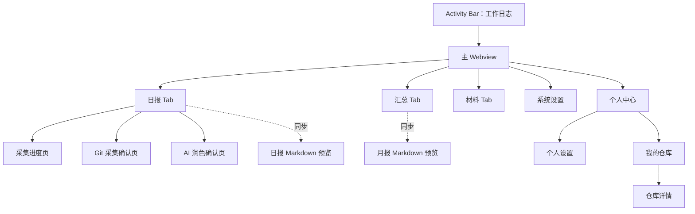

# 当前页面功能与代码结构说明

> 基线：`main` / `118c5b3`（2026-07-26）
>
> 目的：记录当前用户可见页面、实际可达功能、Webview 与扩展端的交互边界，作为后续功能调整和代码重构的共同基线。

扩展端与 Webview 均采用 `src/{module}/{commands|views|utils|layout|hooks|types}`。当前模块包括 `app`、`daily`、`collection`、`projects`、`summary`、`settings`、`database`、`preview` 和 `shared`。SQLite 文件固定为存储根目录下的 `work-log.sqlite`；旧 JSON、TSV 和仓库注册表只作为自动迁移输入与过渡版本兼容输出。

## 1. 产品入口与页面层级

扩展的主要入口是 VS Code Activity Bar 中的“📋 工作日志”，对应 Webview View：

- View ID：`daily-work-log.chatView`
- 前端入口：`web/src/app/pages/App.tsx`
- 扩展端入口：`src/app/views/ChatViewProvider.ts`
- 激活与工具栏命令：`src/app/commands/extension.ts`

主 Webview 没有路由库。`App.tsx` 通过 `tab`、`showPanelSettings`、`showProfile`、`collectLoading`、`fillReview` 等状态和提前 `return` 切换页面。

## 2. 全局交互规则

### 2.1 状态恢复

Webview 使用 VS Code Webview State 保存以下状态：

- 当前主 Tab；
- 当前日报日期；
- Git 采集范围：单日、本周、自定义；
- 自定义范围的开始和结束日期。

重新显示 Webview 时，扩展端根据 `activeDate` 加载对应日报。

### 2.2 通知

大部分操作结果通过 Webview 顶部的短时通知显示，默认约 2 秒后消失。文件选择、删除确认、覆盖确认和错误信息也可能使用 VS Code 原生提示框。

### 2.3 配置来源

当前配置来自三个位置：

1. VS Code Configuration：
   - 日志存储路径；
   - 自动保存；
   - Markdown 预览开关。
2. 插件设置 JSON：
   - Git、AI、显示、导出、工时表、邮件等业务设置。
3. VS Code Secret Storage：
   - AI API Key；
   - 邮件密码。

前端同时维护 `AppConfig` 和 `PluginSettingsForm` 两套配置模型。

## 3. 日报 Tab

### 3.1 页面目标

按日期查看和编辑日报；从 Git 生成工作证据；使用 AI 生成 AILog；将确认后的数据写入每日 JSON。

### 3.2 日期与采集范围

- 支持前一天、后一天、日期选择和返回今天；
- 采集范围支持：
  - 单日；
  - 本周；
  - 自定义开始/结束日期；
- 切换采集范围时，如果存在未提交的确认数据，会要求确认后丢弃；
- 自定义日期范围会被标准化，避免开始日期晚于结束日期。

### 3.3 日报字段

始终显示：

- 今日完成 `completed`；
- AILog `ailog`；
- 相关仓库 `origin_url`。

可由设置控制：

- GitLog `gitlog`；
- GitCommit `gitCommit`；
- 明日计划 `plan`；
- 阻碍/问题 `blockers`；
- 备注 `notes`。

当“日报同步字段显示控制”关闭时，日报编辑页显示全部可选字段；开启后跟随个人中心的字段勾选结果。

数组字段支持新增、编辑和删除：

- 输入后点击“添加”；
- `Ctrl/Cmd + Enter` 快速添加；
- 编辑时 `Ctrl/Cmd + Enter` 保存，`Escape` 取消；
- 重复文本不会再次添加。

“相关仓库”使用当月已知的 `origin_url` 作为下拉建议，也允许手工输入。

### 3.4 保存

- 自动保存开启时：修改后延迟约 800ms 保存；
- 自动保存关闭时：页面底部显示手动保存按钮；
- 数据最终由 `WorkLogManager.saveDailyLog()` 写入日期 JSON。

### 3.5 Git 与 AI 操作

| 操作 | 当前行为 |
|---|---|
| Git 采集 | 执行 Git 扫描，生成按天的 GitLog、GitCommit、相关仓库确认数据 |
| 重新扫描 | 上一次采集命中缓存时出现；忽略缓存重新扫描 |
| 采集并润色 | Git 采集完成后继续 AI 润色 |
| AI 润色 | 基于已有 Git 采集数据生成 AILog，不重复执行 Git 脚本 |

AI 操作需要已配置 API Key。未配置时会提示并打开系统设置。

### 3.6 侧边预览

进入日报 Tab 时，如果启用了 Markdown 预览，会打开或更新一个独立的日报预览 Panel。切换日期会同步更新预览。

### 3.7 主要代码

- 页面与状态：`web/src/app/pages/App.tsx`
- 范围切换：`web/src/shared/views/ScopeToggle.tsx`
- 日期数据：`src/daily/commands/dailyMessages.ts`
- Git/AI 流程：`src/collection/commands/collectMessages.ts`
- 日报预览：`src/preview/commands/previewMessages.ts`
- 存储：`src/daily/utils/workLogManager.ts`

## 4. 采集进度页

### 4.1 进入条件

Git 采集、AI 润色或组合流程开始后，主界面被全屏采集进度页替换。

### 4.2 当前功能

- 显示流程标题；
- 实时追加采集、脚本或 AI 输出；
- 自动滚动到最新日志；
- 支持取消采集；
- 完成后：
  - 成功则进入确认页；
  - 取消则显示取消通知；
  - 失败则显示错误通知。

### 4.3 主要代码

- UI：`web/src/shared/views/CollectLoadingOverlay.tsx`
- 流程与取消：`src/collection/commands/collectMessages.ts`
- 运行日志还会写入 `Daily Work Log` Output Channel。

## 5. Git 采集确认页

### 5.1 页面目标

让用户在实际写入日报前逐日检查 Git 采集结果。

### 5.2 当前功能

- 标题显示采集步骤、范围和锚点日期；
- 每天可以单独决定是否写入；
- 可以维护当日 `completed`；
- Commit 默认全部选中，取消某条时会同步从 GitCommit 和匹配的 GitLog 中删除；
- GitLog 和 GitCommit 都可继续编辑、添加或删除；
- 相关仓库只读展示；
- 显示按天警告；
- “确认写入 Git 字段”后写入日报；
- 返回会丢弃当前内存预览。

### 5.3 主要代码

- 页面：`web/src/collection/pages/FillReviewPage.tsx`
- Commit 同步：`web/src/collection/views/CommitItem.tsx`
- 写入处理：`src/collection/commands/collectMessages.ts`

## 6. AI 润色确认页

### 6.1 页面目标

在写入 AILog 前，逐日检查和调整 AI 生成结果。

### 6.2 当前功能

- 每天可决定是否写入；
- AILog 候选可新增、编辑、删除；
- 显示生成警告；
- 支持“重新 AI 润色”，复用当前内存确认数据；
- “确认写入 AILog”后合并进日报 JSON；
- 不直接覆盖 `completed`、GitLog 或 GitCommit。

### 6.3 主要代码

与 Git 确认页共用：

- `web/src/collection/pages/FillReviewPage.tsx`
- `src/collection/commands/collectMessages.ts`
- `src/collection/utils/aiPolishService.ts`

## 7. 汇总 Tab

### 7.1 页面目标

按月查看所有日报，并生成月度相关产物。

### 7.2 月份导航

- 支持上一月、下一月；
- 年份下拉目前固定为 2024、2025、2026、2027；
- 月份下拉为 1–12 月；
- “刷新”会清理月汇总缓存并重新加载。

### 7.3 日志列表

每条日报始终显示：

- 日期；
- 完成；
- AILog；
- 相关仓库。

其余字段根据个人中心的显示字段设置决定：

- GitLog；
- GitCommit；
- 计划；
- 阻碍；
- 备注。

每条记录右侧的编辑按钮会切回日报 Tab 并打开对应日期。

### 7.4 月度操作

- 生成工时表；
- AI 润色/总结（仅 AI 启用时显示）；
- 全日期工时表（仅 `timesheetFullDateEnabled` 开启时显示）；
- 自动打开并同步月报 Markdown 预览。

### 7.5 主要代码

- 页面：`web/src/app/pages/App.tsx`
- 月度数据：`src/daily/commands/dailyMessages.ts`
- 工时表、AI 月报：`src/summary/commands/summaryMessages.ts`
- 月报预览：`src/preview/commands/previewMessages.ts`

## 8. 材料 Tab

### 8.1 页面目标

浏览日志存储目录下按月份组织的材料，并进行打开、删除和邮件发送。

### 8.2 当前功能

- 按月份倒序展示材料；
- 默认过滤形如 `YYYY-MM-DD.json` 的日报 JSON；
- 每个文件可勾选；
- 打开：在系统文件管理器中定位文件；
- 删除：扩展端使用模态确认后删除；
- 发送：将当月已选文件作为邮件附件；
- 同月多个 `Timesheet-*.xlsx` 只展示修改时间最新的一份。

### 8.3 当前风险

开启“过滤日报 JSON”后，界面使用过滤后数组的索引更新原始文件数组。如果被隐藏的 JSON 位于可见文件之前，勾选可见文件可能修改错误的文件选择状态。后续调整时应改为按文件路径或稳定 ID 更新。

### 8.4 主要代码

- 页面：`web/src/app/pages/App.tsx`
- 文件列表、打开、删除、邮件：`src/summary/commands/summaryMessages.ts`
- 邮件配置：个人中心。

## 9. 系统设置页

### 9.1 进入方式

- Activity Bar View 标题栏的设置按钮；
- 命令 `daily-work-log.openPanelSettings`；
- AI Key 未配置时由 AI 操作自动引导进入。

### 9.2 VS Code 配置（只读）

- 解析后的日志存储路径；
- 是否自动保存；
- 是否启用 Markdown 预览。

这些值不能在当前页面直接修改，需要通过 VS Code Settings 修改。

### 9.3 Git 采集设置

- Git 搜索根目录；
- Origin 过滤；
- 作者别名；
- 历史日期采集缓存；
- 采集后自动 AI 润色；
- 周末 Commit 并入周一。

### 9.4 AI 设置

- 启用 AI；
- 预设：DeepSeek、小米 MiMo、自定义；
- Base URL、Model；
- Thinking 开关；
- `reasoning_effort`；
- Temperature；
- 请求超时；
- Thinking 流式日志；
- System Prompt 编辑与恢复默认；
- API Key 查看和修改。

### 9.5 保存行为

保存时会整体提交 `PluginSettingsForm`，并按需更新 API Key。保存成功后关闭设置页并刷新主页面配置。

### 9.6 主要代码

- 页面：`web/src/settings/pages/SettingsPage.tsx`
- 通用字段：`web/src/settings/views/SettingField.tsx`
- Secret 输入：`web/src/shared/views/SecretField.tsx`
- 设置读写：`src/settings/commands/settingsStore.ts`
- 统一运行路径：`src/settings/utils/pathUtils.ts`
- 设置定义：`src/settings/types/pluginSettings.ts`
- 字段元数据：`src/shared/utils/settingsSchema.ts`

## 10. 个人中心

个人中心内部包含“个人设置”和“我的仓库”两个子 Tab。

### 10.1 个人设置

#### 导出与显示

- 显示姓名；
- 所有数据库、采集缓存和月份材料统一使用日志存储路径；
- 工时表内容字段：AILog、Completed、GitLog 或 GitCommit；
- 日报是否同步字段显示控制；
- 汇总额外显示字段。

#### 邮件

- SMTP Host；
- 发件人；
- 收件人；
- 邮件密码查看和修改。

界面模型中还包含 SMTP Port、Username、CC，但当前个人设置页没有对应可见输入框。

### 10.2 主要代码

- 页面：`web/src/settings/pages/ProfilePage.tsx`
- 设置保存仍复用系统设置的 `savePluginSettings` 流程。

## 11. 我的仓库

### 11.1 仓库列表

- 数据来自 Git 采集维护的仓库注册表；
- 按 Origin 将多个本地 Clone 聚合为一个仓库组；
- 支持按仓库名、Origin、路径搜索，输入防抖约 300ms；
- 显示最近 Commit 日期和 Clone 数量；
- 支持置顶；
- 支持从列表隐藏；
- 只有一个 Clone 时可直接打开；
- 没有数据时提示先执行 Git 采集。

### 11.2 仓库详情

- 显示仓库 Origin；
- 每个 Clone 都有单独的“打开”按钮；
- “全部”与各 Clone 标签切换活动范围；
- 以日期分组展示 AILog；
- Commit 默认折叠，展开后最多显示 100 条；
- Commit 显示日期、短 SHA 和标题。

扩展端返回数据中包含 `gitlogLines`，但仓库详情当前没有渲染 GitLog。

### 11.3 主要代码

- 列表：`web/src/projects/pages/ProjectListPage.tsx`
- 列表项：`web/src/projects/views/RepoListItem.tsx`
- 详情：`web/src/projects/pages/ProjectDetailPage.tsx`
- Clone 标签：`web/src/projects/views/CloneTagBar.tsx`
- 注册表与活动聚合：`src/shared/utils/repoRegistry.ts`
- 消息处理：`src/projects/commands/projectMessages.ts`

## 12. 独立 Markdown 预览 Panel

### 12.1 日报预览

- 日报 Tab 打开时自动显示；
- 日期变化时更新；
- 展示字段跟随日报字段可见性设置；
- 更新使用约 200ms 防抖。

### 12.2 月报预览

- 汇总 Tab 打开时自动显示；
- 年月变化时更新；
- 展示当月所有日报；
- 离开汇总 Tab 时关闭。

### 12.3 材料 Tab

进入材料 Tab 会关闭日报和月报预览。

### 12.4 主要代码

- `src/preview/commands/previewMessages.ts`

## 13. Webview 消息与处理器映射

| 页面/功能 | Webview 消息 | 扩展端处理 |
|---|---|---|
| 初始化 | `ready` | `ChatViewProvider._updateWebview` |
| 加载/保存日报 | `loadDate` / `save` | `dailyLogHandler` |
| 月度汇总 | `loadMonthLogs` / `clearSummaryCache` | `dailyLogHandler` |
| Git 采集 | `collectGitFill` | `collectHandler.collectGitFill` |
| 采集并润色 | `collectAndPolish` | `collectHandler.collectAndPolish` |
| AI 润色 | `aiPolishFill` | `collectHandler.aiPolishFill` |
| 确认写入 | `applyFillPreview` | `collectHandler.applyFillPreview` |
| 取消/丢弃 | `cancelCollect` / `discardFillPreview` | `collectHandler` |
| 工时表 | `generateTimesheet` / `generateTimesheetFull` | `timesheetHandler.generateTimesheet` |
| 月度 AI | `aiGenerateAll` | `timesheetHandler.generateAiAll` |
| 材料 | `listMaterials` / `openMaterial` / `deleteMaterial` | `timesheetHandler` |
| 邮件 | `sendEmailWithAttachments` | `timesheetHandler.sendMaterialsEmail` |
| 系统/个人设置 | `getPluginSettings` / `savePluginSettings` | `settingsHandler` |
| Secret | `revealPluginSecret` | `settingsHandler` |
| 仓库列表/详情 | `listRepos` / `getRepoDetail` | `repoHandler` |
| 仓库操作 | `openRepoInVscode` / `updateRepo` | `repoHandler` |
| 日报/月报预览 | `open*Preview` / `update*Preview` / `close*Preview` | `previewHandler` |

消息使用字符串和 `any` 在前后端传递，目前没有统一的请求/响应联合类型或运行时校验。

## 14. 命令面板与兼容页面

扩展注册以下主 Webview 辅助命令：

- 快速打开侧边栏；
- 打开系统设置；
- 刷新；
- 打开个人中心；
- 打开 Output Channel。

旧日报、旧月度汇总独立 Webview 及其命令已经删除，页面功能统一由侧边栏 React Webview 承载。

## 15. 当前可达性检查

| 功能 | 扩展端实现 | 前端实现 | 当前页面可达 |
|---|---:|---:|---:|
| 日报编辑与保存 | 是 | 是 | 是 |
| Git 采集与确认 | 是 | 是 | 是 |
| AI 润色与确认 | 是 | 是 | 是 |
| 月度日志 | 是 | 是 | 是 |
| 工时表 | 是 | 是 | 是 |
| 全日期工时表 | 是 | 是 | 取决于隐藏设置 |
| 月度 AI 汇总 | 是 | 是 | AI 开启时可达 |
| 材料浏览/删除/发送 | 是 | 是 | 是 |
| 仓库 GitLog 展示 | 数据已返回 | 未渲染 | 否 |

## 16. 后续功能调整前应关注的结构问题

### 16.1 `App.tsx` 责任过多

当前文件同时负责：

- 全局状态；
- 页面切换；
- Webview 消息监听；
- 日报 CRUD；
- 采集流程；
- 汇总；
- 材料；
- 设置和 Secret；
- 三个主 Tab 的完整渲染。

任何页面调整都可能触碰同一文件，适合优先拆成页面容器、共享状态和消息客户端。

### 16.2 页面切换不是显式状态机

多个布尔值与 `fillReview`/`collectLoading` 决定哪个页面提前返回。新增长流程页面时容易产生互斥和返回路径问题。

### 16.3 消息协议未类型化

前端和扩展端都大量使用字符串命令与 `any`，字段拼写错误只能在运行时发现。仓库已有 `src/shared/utils/webviewMessages.ts` 常量，但主分发和前端并未统一使用。

### 16.4 类型与配置模型重复

`DailyLog`、`AppConfig`、`PluginSettingsForm`、Repo Activity 等类型在前端和扩展端重复定义，容易发生字段漂移。

### 16.5 设置页面按入口拆分，但保存模型仍是整体

系统设置和个人中心编辑同一个完整设置对象，并复用同一个保存接口。后续增加分区保存、校验或权限控制时，需要明确各设置区的所有权。

### 16.6 已清理的不可达功能

XLSX 导入、单月文件列表、无入口的单工时表邮件流程和旧独立 Webview 已删除。材料页多附件邮件保留。仓库 GitLog 将随 SQLite 项目活动模型统一改造。

### 16.7 主流程测试覆盖不足

当前自动化测试只有模板测试和“缺失月份目录”回归测试。页面消息、采集确认、设置保存、材料选择等关键流程尚无自动化覆盖。

## 17. 建议的下一轮讨论顺序

1. 确认三大主 Tab 是否仍是目标信息架构；
2. 统一日报、项目活动和 AI 对话的数据归属模型；
3. 明确日报、Git 证据、AILog 和月度材料的数据边界；
4. 定义类型化 Webview 消息协议；
5. 将 `App.tsx` 按页面和流程拆分；
6. 统一系统设置、个人设置和 VS Code 配置的职责；
7. 为调整后的关键用户流程补测试。
